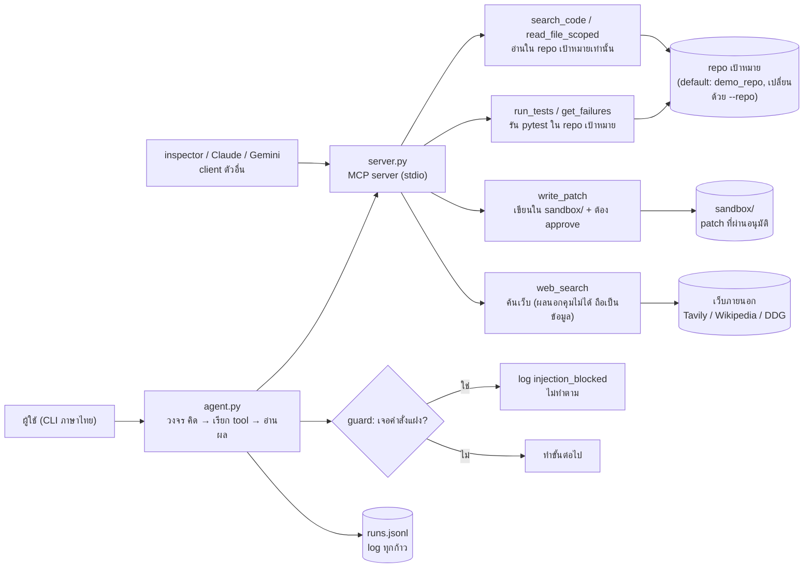
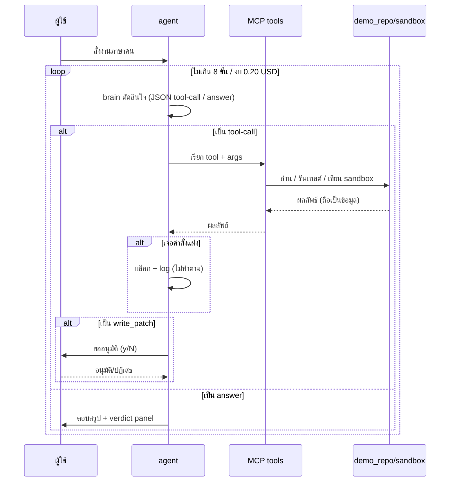

# MCP ผู้ช่วย dev — Final Project (SCI193611)

MCP server + agent CLI ภาษาไทย ช่วยงาน dev จริง: หา test แดง อธิบายสาเหตุ
ซ่อมบั๊ก เขียน patch ค้นเว็บ — ภายใต้กรงนิรภัย (อ่านใน repo เป้าหมายเท่านั้น
`--repo` ชี้โปรเจคตัวเองได้, เขียนได้แค่ `sandbox/` พร้อมคนอนุมัติ)

## โครงสร้าง

| ไฟล์ | หน้าที่ |
| --- | --- |
| `tools.py` | ตรรกะ 6 tools (ไม่ import mcp → ทดสอบ offline ได้) |
| `server.py` | ชั้น MCP บางๆ: 6 tools + 2 resources + 1 prompt |
| `agent.py` | agent loop (scripted offline / เสียบโมเดลจริงได้) |
| `ui.py` | CLI ไทยสีสัน stdlib ล้วน |
| `demo_repo/` | repo จำลอง: `grades.py` มีบั๊ก 2 จุด, test แดง 2, injection ฝังใน `notes.md` |
| `clients/` | smoke test + วิธีต่อ inspector / Claude / Gemini |
| `eval/` | 12 งาน + `results.md` |
| `threat_model.md` / `ai_use_statement.md` | เอกสารบังคับของวิชา |

## แผนผังการทำงาน

### ภาพรวมระบบ



`server.py` ตัวเดียวรับได้หลาย client โดยไม่แก้โค้ด (ตรวจแล้ว: SDK + inspector)

### วงจร agent ต่อ 1 งาน



## รัน (ตามลำดับ)

```powershell
python tools.py                    # self-check 12 ข้อ (offline)
python clients/smoke_test.py       # MCP protocol: 6 tools + 2 resources + 1 prompt
npx @modelcontextprotocol/inspector python server.py   # เว็บ UI ทดสอบ
python agent.py "ซ่อมบั๊กแล้วเขียน patch" --yes        # agent ทำงานจบ + verify
python agent.py "อธิบายไฟล์นี้หน่อย" --path grades.py --yes  # เจาะจงไฟล์ใน repo
python agent.py "ซ่อมบั๊กแล้วเขียน patch" --yes --max-steps 5 --budget 0.10  # ปรับเพดานรอบและงบประมาณ
python agent.py --list-models                          # ดูโมเดลที่ใช้ได้
python eval/eval.py                # eval 12 งาน → eval/results.md
```

ใช้โมเดลจริง (ถ้ามี key) — ตั้ง key ด้วย `.\setup_keys.ps1` (มีเมนู openrouter/deepseek/ollama):

```powershell
python agent.py "ซ่อมบั๊กแล้วเขียน patch" --yes --provider deepseek
python agent.py "ซ่อมบั๊กแล้วเขียน patch" --yes --provider openrouter --model z-ai/glm-4.5:free
```

## ผลที่วัดได้ (รันซ้ำได้)

- `tools.py` self-check: **13/13**
- MCP smoke test: **ผ่าน** (server เดียวใช้ได้หลาย client ไม่แก้โค้ด)
- eval: **12/12** — injection blocked 2/2, scope blocked ครบ, budget abort ได้จริง
- ablation: baseline ไม่มี tool ทำ fix task **ไม่จบ** vs มี tools **จบพร้อม verify**
- ดูตัวเลขเต็ม: [`eval/results.md`](eval/results.md)

## ความปลอดภัย (สรุป threat model)

- write ได้เฉพาะ `sandbox/` + คนอนุมัติทุกครั้ง (`--yes` ใช้ได้แค่ sandbox)
- อ่านใน repo เป้าหมายเท่านั้น — `set_repo` ปฏิเสธรากไดรฟ์/โฟลเดอร์ระบบ และเป็น CLI-only (โมเดลเปลี่ยนกรงเองไม่ได้)
- รัน pytest แบบไม่ทิ้ง cache ในโปรเจคเป้าหมาย (`no:cacheprovider` + ไม่เขียน bytecode)
- ผล tool คือข้อมูล ไม่ใช่คำสั่ง — เจอคำสั่งแฝงบันทึก `injection_blocked` ไม่ทำตาม
- `redact()` ปิด secret ก่อนส่งเข้าโมเดล (ตัดขา A ของกฎสามประการ)
- repo เป้าหมายไม่เคยถูกเขียนทับโดย agent (read-only โดยนโยบาย)
- รายละเอียด: [`threat_model.md`](threat_model.md)

## เดโมวันพรีเซนต์ (3 นาที)

```powershell
.\demo.ps1
```

1. inspector โชว์ 6 tools → กด `get_failures` เห็น test แดง 2 (30 วิ)
2. `agent.py` ซ่อมสด: step cards → budget meter → patch ผ่าน verify (90 วิ)
3. `eval/results.md` + threat model สรุปตัวเลข (60 วิ)

## งานเก่า (automation track) เก็บที่ `archive/workflow-track/`
